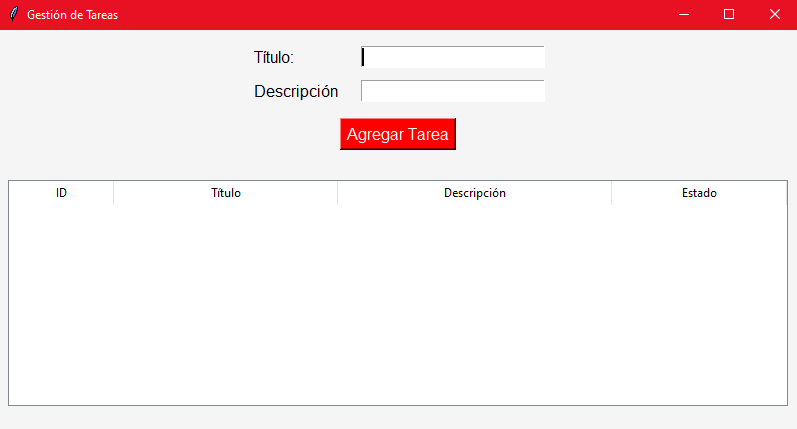
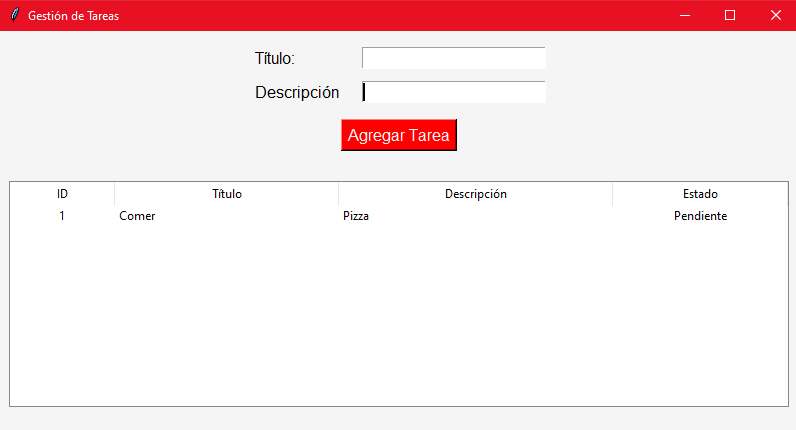
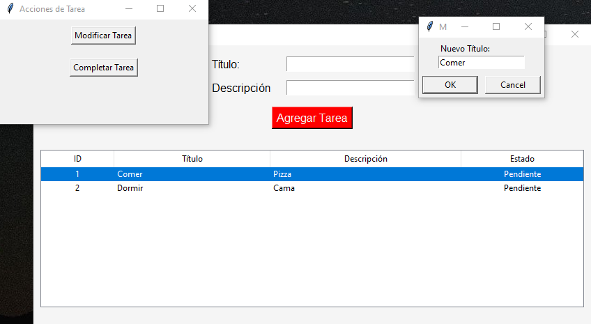
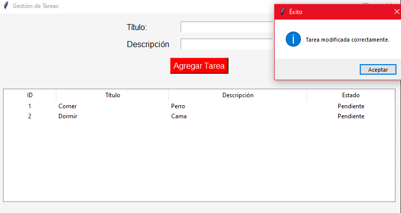
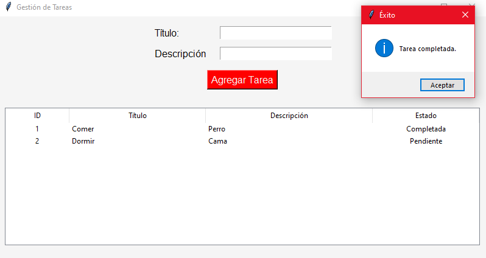
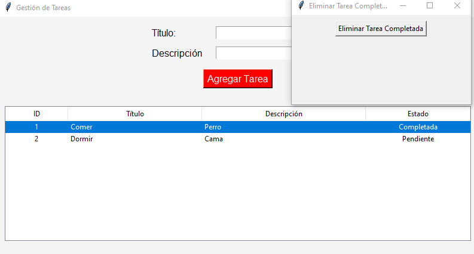
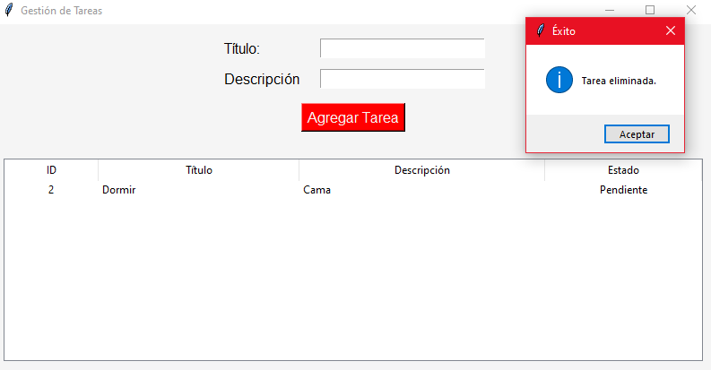

# Gestión de Tareas

Este proyecto es una aplicación de gestión de tareas desarrollada en Python utilizando SQLite como base de datos, SQLAlchemy como ORM y una interfaz gráfica basada en Tkinter. La aplicación permite agregar, listar, modificar, completar y eliminar tareas.

## Tabla de Contenidos

- [Requisitos](#requisitos)
- [Estructura del Proyecto](#estructura-del-proyecto)
- [Instalación](#instalación)
- [Uso](#uso)
- [Funciones Principales](#funciones-principales)

## Requisitos

- Python 3.8 o superior
- SQLite

Bibliotecas externas necesarias:
- `sqlalchemy`
- `tkinter` 

## Estructura del Proyecto

```
├── controller/        # Lógica de negocio para cada servicio
│   └── controller.py  
├── database/          # Configura la base de datos SQLite y define el modelo de datos Tarea.
│   └── database.py
├── model/             # Implementa las operaciones CRUD y funciones relacionadas con las tareas.
│   └── model.py
├── view/              # Implementa la interfaz gráfica de la aplicación.
│   └── view.py
├── tareas.json        # Archivo de respaldo para almacenar las tareas.
├── tareas.db          # Archivo de la base de datos
└── README.md
```

## Instalación

1. Clona el repositorio o descarga el código fuente.

3. Instala las dependencias ejecutando:

    ```bash
    pip install sqlalchemy
    ```

4. Navega al directorio raíz del proyecto.

## Uso

1. Ejecuta el archivo principal:

    ```bash
    python view/view.py
    ```

2. La interfaz gráfica de la aplicación se abrirá.
3. Desde la interfaz puede agregar, listar, modificar, completar y eliminar tareas.

## Funciones Principales

### Agregar Tarea
Permite agregar una nueva tarea ingresando un título y una descripción. Si el título ya existe, mostrará un error.

### Listar Tareas
Muestra todas las tareas almacenadas.

### Modificar Tarea
Permite cambiar el título y la descripción de una tarea existente.

### Completar Tarea
Cambia el estado de una tarea a "Completada".

### Eliminar Tarea
Elimina tareas que ya estén completadas.

# Fotos del aplicativo

## Inicio


## Agregar tarea


## Modificar tarea


## Tarea modificada


## Completar tarea


## Eliminar tarea confirmada


## Eliminacion confirmada
